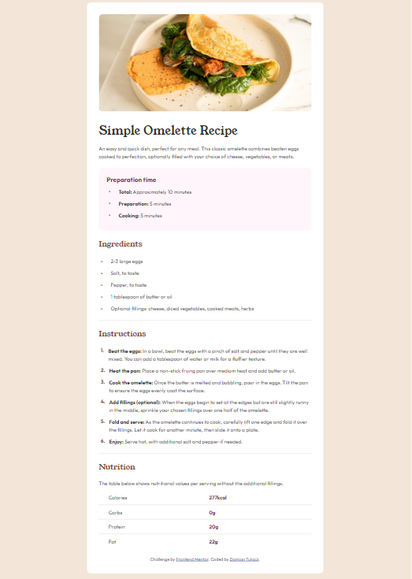

# Frontend Mentor - Recipe page solution

This is a solution to the [Recipe page challenge on Frontend Mentor](https://www.frontendmentor.io/challenges/recipe-page-KiTsR8QQKm).

## Table of contents

- [Overview](#overview)
  - [Screenshot](#screenshot)
  - [Links](#links)
  - [Built with](#built-with)
- [Author](#author)

## Overview

### Screenshot

### Links

- Solution URL: [github.com/Damiant94/Recipe-page](https://github.com/Damiant94/Recipe-page)
- Live Site URL: [damiant94.github.io/Recipe-page/](https://damiant94.github.io/Recipe-page/)

### Built with

- Semantic HTML5 markup
- CSS

## Author

- LinkedIn - [linkedin.com/in/damiantulacz/](https://www.linkedin.com/in/damiantulacz/)
- GitHub - [github.com/damiant94](https://github.com/damiant94)
